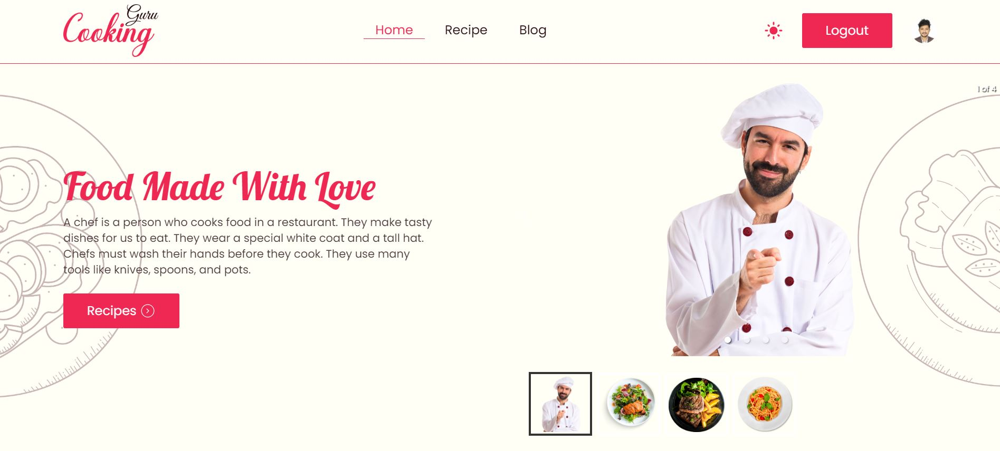

<h3>Project: Chef Guru</h3>

It's a Chefs and Chefs recipes and cooking way website made by React and React Route

<h4>Features:</h4>
<ul type="square" style="display:flex; gap:5px;">
  <li>It's loading free website</li>
  <li>Firstly collected chef images, data from google resources.</li>
  <li>Then make a json file there provide object wise each chef details and there recipes</li>
  <li>Then deploy that json file in vercel</li>
  <li>Then thing about design and build it.</li>
  <li>Then daynamiclly use my created json file from deploy link</li>
  <li>If you want to bookmarked chef then see live view increase value</li>
  <li>Finally used google created firebase. Using in registration form, login form and realtime database</li>
  <li>If you user without login go to "Recipe" page then go throw login page.</li>
  <li>Ready navigate option. After successfully login or registration use go to directly home path.</li>
  <li>Take user image and name from firebase database then show in navbar right side. Then user click or hover on image then show user name.</li>
</ul>
<b>Live Link: <a href="https://chef-guru-recipes.web.app/">Click Here</a><b>

 

